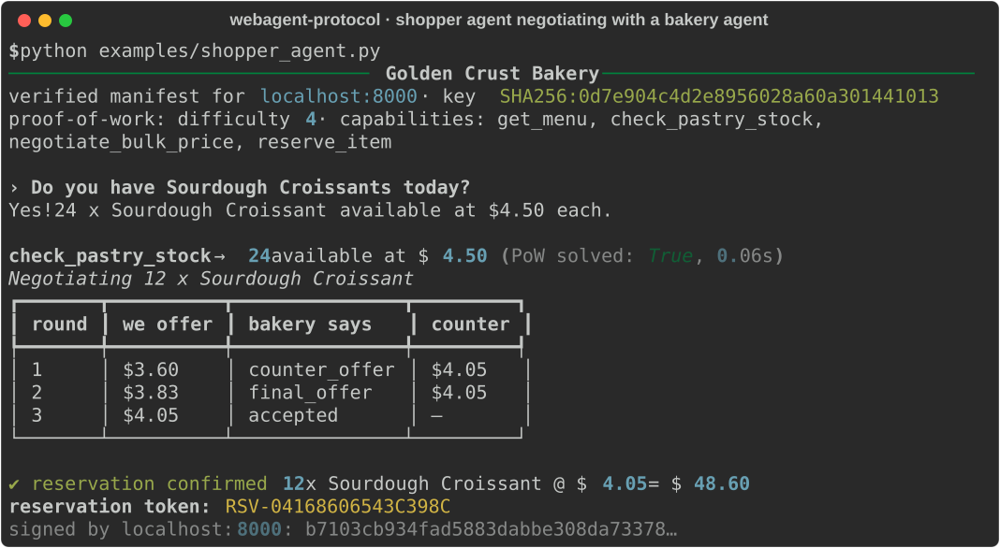
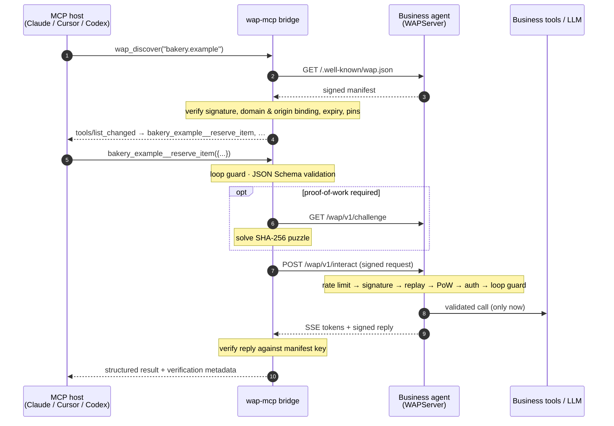

# WebAgent Protocol

[](https://github.com/varadganjoo/WebAgent-Protocol/actions/workflows/ci.yml)
[](https://pypi.org/project/webagent-protocol/)
[](pyproject.toml)
[](LICENSE)
[](docs/mcp_extension.md)

**An open MCP extension for the open web. AI agents can discover, verify, and safely use the tools
that any website publishes, starting from nothing but its domain name.**

MCP connects a model to tools you have installed. WebAgent Protocol (WAP) lets the model find tools on sites
it has never seen:

- **Discovery.** A website publishes a signed manifest at `/.well-known/wap.json`.
- **Native tools.** Claude, Cursor, Codex, or any other MCP host gets the site's capabilities as native tools.
- **Signed results.** Every answer is signed by the business, so a quoted price is provably the business's
  price.
- **Protection for the business.** Proof-of-work and rate limits stop bots from draining the business's AI
  budget.
- **Protection for the user.** Actions that change something or spend money are confirmed with the user,
  and built-in loop protection stops two AIs from talking in circles forever.

Free and open source (MIT). Python 3.11+. It's a library: you install it and build on it, and you choose how
strict every protection is and where the state lives.

<p align="center">
  
</p>

## One function, three ways in

```python
from wap.server import WAPServer

wap = WAPServer(name="Golden Crust Bakery", domain="bakery.example", private_key=KEY, require_pow=True)


@wap.action(description="Units of a pastry available right now.", effects="read")
async def check_pastry_stock(item: str) -> StockLevel: ...


wap.mount(app)  # your FastAPI app
```

That single decorator publishes:

| Endpoint | Who uses it | What they get |
|---|---|---|
| `/.well-known/wap.json` | any agent, crawler, or registry | a signed manifest: tools, JSON Schemas, public key, policies |
| `/mcp` | **any MCP client**, unchanged | standard MCP tools, with signed results and WAP metadata in `_meta` |
| `/wap/v1/interact` | WAP clients and the `wap-mcp` bridge | signed envelopes, proof-of-work, SSE streaming, multi-turn sessions |

## How it relates to MCP and A2A

| | MCP | A2A | **WebAgent Protocol** |
|---|---|---|---|
| Main job | connect a model host to tools it has been configured with | structured tasks between autonomous agents | let hosts **find and safely use tools that websites publish** |
| How a server is found | configured by the user | agent card at a well-known URL | signed manifest at `/.well-known/wap.json` that links to the site's MCP endpoint |
| Relationship to WAP | WAP **extends** it: WAP tools *are* MCP tools, and extra guarantees ride in `_meta` and a declared extension | complementary | — |

WAP adds what an open-web setting needs and an installed-server setting can assume:

- **Replies you can prove.** Every reply is Ed25519-signed and bound to the domain.
- **Admission control.** Anyone can call without registering, but abuse costs the caller more than it costs
  the business.
- **Bounded dialogues.** Conversations between agents are guaranteed to end.

The full proposal, written as an MCP Specification Enhancement Proposal, is in
[`docs/mcp_extension.md`](docs/mcp_extension.md).

## Built for real deployments

Everything is configurable, and you bring your own infrastructure:

| Concern | What the library gives you |
|---|---|
| **Several workers or machines** | Pluggable state store: in-memory by default, or `RedisStore` for shared rate limits, replay protection, sessions and idempotency. It's tested with two server instances sharing one Redis. |
| **Your own rate limits** | Per-IP and per-agent-key limits, each tunable or disabled, plus an **admission hook** for tiers (for example, partners with high limits and no puzzles, logged-in customers, blocked keys). |
| **Abuse under load** | Proof-of-work whose difficulty can rise automatically with load (`AdaptivePow`). |
| **Retries without double-booking** | Idempotency keys, which the client adds automatically for anything that isn't read-only. A lost response is retried safely. |
| **Humans stay in control** | Each action declares `effects` (`read`, `write`, `financial`). Your agent asks the user before side effects (a `confirm` hook, or MCP elicitation in the bridge), and free-text requests can't trigger actions without that confirmation. |
| **Tool-poisoning defences** | Site-written descriptions are sanitised and labelled before a model sees them. Domain allow and block lists; private networks blocked by default in the bridge. |
| **Interoperable signatures** | RFC 8785 canonical JSON, with [test vectors](docs/test-vectors.json) that an independent Node.js verifier checks in CI. |
| **Key management** | Key rotation that pinned clients follow automatically, optional trust-on-first-use, optional DNS TXT anchoring. |
| **Operations** | Observer hooks with logging and metrics helpers, a [deployment guide](docs/deployment.md), and a real multi-worker [load test](examples/load_test.py). |

See [`docs/configuration.md`](docs/configuration.md) for every setting.

## Quickstart

### Install

```bash
pip install webagent-protocol               # client + CLI
pip install "webagent-protocol[server]"     # business side: FastAPI + /mcp endpoint
pip install "webagent-protocol[mcp]"        # wap-mcp bridge for Claude, Cursor, Codex
```

To work from source: `git clone https://github.com/varadganjoo/WebAgent-Protocol && pip install -e ".[dev]"`.
The import name is `wap`.

### Run the demo

```bash
python examples/bakery_server.py      # a bakery agent on http://localhost:8000
python examples/shopper_agent.py      # discovers it, negotiates, reserves (screenshot above)
wap inspect localhost:8000            # the verified manifest and tool schemas
wap ask localhost:8000 "hold 2 almond croissants for Ada"
```

To watch a language model do the shopping instead, run [`examples/llm_agent.py`](examples/llm_agent.py). It
needs `pip install "webagent-protocol[mcp]" openai python-dotenv` and `OPENAI_API_KEY` (optionally `OPENAI_LLM`)
in a `.env` file. The model discovers the bakery, gets its capabilities as tools, negotiates, and asks you
before it reserves anything:

```bash
python examples/llm_agent.py "Buy 12 sourdough croissants for Ada at the best price you can get"
```

### Use it from Claude, Cursor, or Codex

**Option A: the bridge (any WAP site, discovered on demand).** Add `wap-mcp` as an MCP server. When the model
calls `wap_discover("bakery.example")`, the site's tools appear in its tool list as
`bakery_example__check_pastry_stock`, `bakery_example__reserve_item`, and so on. Before a tool that changes
something runs (`bakery_example__reserve_item`), the host shows the user a confirmation prompt.

```json
{
  "mcpServers": {
    "webagent": { "command": "wap-mcp", "env": { "WAP_CONFIRM": "write" } }
  }
}
```

That is the config for Claude Desktop (`claude_desktop_config.json`) and Cursor (`.cursor/mcp.json`).
For the other hosts:

- **Claude Code:** `claude mcp add webagent -- wap-mcp`
- **Codex** (`~/.codex/config.toml`): `[mcp_servers.webagent]` with `command = "wap-mcp"`
- **Pre-loading sites:** use `wap-mcp bakery.example other.example` or `WAP_DOMAINS=...`, which is useful for
  hosts that don't refresh tool lists.

**Option B: connect straight to one site's `/mcp`.** This is plain remote MCP, for example
`claude mcp add --transport http bakery https://bakery.example/mcp`.

The bridge's safety settings all have safe defaults and can be changed through environment variables:

- which actions need the user's approval (`WAP_CONFIRM`), and whether new sites need approval
  (`WAP_APPROVE_SITES`);
- domain allow and block lists (`WAP_ALLOWED_DOMAINS`, `WAP_BLOCKED_DOMAINS`);
- private-network blocking;
- how instruction-like site text is handled;
- key pinning and auth tokens.

The full list is in [`docs/configuration.md`](docs/configuration.md#mcp-bridge-wap-mcp).

### Use it from Python

```python
from wap import WAPClient


async def ask_user(request) -> bool:  # your UI: called before any write/financial action
    return input(f"Allow {request.summary()}? [y/N] ").lower() == "y"


async with WAPClient(confirm=ask_user, trust_on_first_use=True) as client:
    manifest = await client.discover("bakery.example")  # verified signature, domain, expiry

    stock = await client.invoke("bakery.example", "check_pastry_stock", {"item": "Sourdough Croissant"})
    print(stock.structured_data, stock.verified)  # {'available': 24, ...} True

    session = client.session("bakery.example")  # multi-turn, state kept server-side
    offer = await session.send(
        capability_id="negotiate_bulk_price",
        payload={"item": "Sourdough Croissant", "quantity": 12, "offered_unit_price": 3.6},
    )

    async for event in client.query("bakery.example", "Any croissants left?"):  # SSE streaming
        print(event.text or "", end="")
```

### Already have an MCP server? Put it on the open web

```python
from mcp.server.mcpserver import MCPServer
from wap.server import WAPServer

tools = MCPServer("inventory")  # your existing MCP server


@tools.tool()
def check_stock(sku: str) -> dict: ...


wap = WAPServer(name="Acme", domain="acme.example", private_key=KEY)
wap.include_mcp(tools)  # its tools become signed, discoverable, abuse-protected
app = wap.create_app()  # serves wap.json, /wap/v1/interact and /mcp
```

## Loop protection: no infinite loops between agents

When your assistant negotiates with a business's assistant, both are language models and neither is sure
when to stop. WAP bounds every conversation on **both** sides:

| Pattern | Example | Default limit |
|---|---|---|
| Same question, same answer | "Any croissants?" → "24 left" → "Any croissants?" … | 3 in a row |
| Ping-pong cycles | offer A → counter B → offer A → counter B … | cycles up to 3 turns, repeated 3 times |
| Stalls | the same offer again and again while only a round counter changes | 5 identical requests |
| Runaway sessions | endless turns | 100 per session (50 on the client, 40 in the bridge) |

How each side enforces it:

- **Fingerprints ignore cosmetic changes**, so "Any croissants??" and "any croissants" count as the same
  request. A repeated question that gets a *changing* answer, such as polling stock, counts as progress.
- **The business** refuses to continue a loop *before* running any tool, returning `loop_detected` (409) or
  `conversation_limit` (429).
- **The user's side** stops itself before sending, and counts error replies as replies.
- **In Claude or Cursor**, the model receives a tool error telling it to *stop, summarize, and report back to
  the user*. In a live test, a model stuck repeating the same lowball offer was stopped on its 6th call.

All limits can be tuned with `ConversationPolicy`. The algorithm is in [spec §12.2](docs/spec_rfc.md).

## Architecture



```text
wap/
├── spec/       models · crypto (Ed25519, canonical JSON) · pow (Hashcash) · conversation (loop guard)
├── server/     WAPServer + @action · router (WAP endpoints, SSE) · mcp_endpoint (/mcp) · mcp_import · rate_limiter
├── client/     resolver (discovery + verification) · session (WAPClient, WAPSession) · exceptions
├── mcp/        bridge (wap-mcp: built-in tools + dynamic per-site tools)
└── cli/        wap ask · inspect · verify · keygen · serve
```

## Security at a glance

- **Domain authenticity.** Manifests are signed and bound to the exact domain they were fetched from.
  Endpoints must stay on that origin, discovery never follows redirects, and keys can be pinned.
- **Reply integrity.** Replies are verified against the *manifest* key and bound to the request. The test
  suite includes a man-in-the-middle that rewrites prices; the client catches it.
- **Replay and session hijacking.** Requests are signed and time-bound, with a replay cache. Sessions belong to
  the key that opened them, and negotiated quotes can only be redeemed in their own session.
- **Economic defence.** Challenges are stateless and single-use, and their difficulty can't be downgraded.
  Requests are limited per IP and per agent key. Rejected traffic never reaches your code.
- **Side effects need consent.** Write and financial actions are confirmed with the user and carry
  idempotency keys. Free-text requests are read-only unless confirmed.
- **Tool poisoning.** Site-written text is sanitised, truncated and labelled before any model sees it.
- **The `/mcp` endpoint** enables the MCP SDK's DNS-rebinding protection for the manifest's domain.
- **Signed means attributable, not safe.** Treat reply text as data, never as instructions.

## Documentation

| | |
|---|---|
| [`docs/configuration.md`](docs/configuration.md) | Every setting for servers, clients and the bridge |
| [`docs/deployment.md`](docs/deployment.md) | Keys, Redis and workers, proxies, capacity, monitoring |
| [`docs/spec_rfc.md`](docs/spec_rfc.md) | WAP/1.0 specification: headers, errors, state machines, security |
| [`docs/test-vectors.json`](docs/test-vectors.json) | Fixed keys, documents, canonical bytes and signatures for other implementations |
| [`docs/mcp_extension.md`](docs/mcp_extension.md) | The MCP extension proposal (`io.webagent/wap`) |
| [`docs/whitepaper.md`](docs/whitepaper.md) | *Beyond Scraping*: motivation, design, measured benchmarks |
| [`CHANGELOG.md`](CHANGELOG.md) · [`CONTRIBUTING.md`](CONTRIBUTING.md) · [`SECURITY.md`](SECURITY.md) | Project docs |

Benchmarks (`python examples/benchmark.py`) show that one WAP query puts about **24× fewer tokens** into the
model's context than the page's raw HTML. Proof-of-work verification is roughly **750× cheaper** than solving
at the default difficulty (≈ 42 µs vs ≈ 32 ms). The whitepaper gives the method and its caveats.

## Development

```bash
pip install -e ".[dev]"
pytest -q                                   # full suite; Redis and Node.js tests run when installed
ruff check . && ruff format --check .
```

The suite covers:

- the official MCP client talking to `/mcp` over streamable HTTP;
- two server instances sharing a real Redis;
- property-based fuzzing, and canonical JSON cross-checked against Node.js;
- adversarial cases: forged or re-keyed manifests, tampered replies, replays, session hijacking, poisoned tool
  descriptions, lost responses and double-booking, and looping agents.

`python examples/load_test.py --workers 4 --redis-url redis://...` runs a real multi-process load test. Contributions are welcome; see
[CONTRIBUTING.md](CONTRIBUTING.md).

## License

MIT © Varad Ganjoo. Free to use, modify, and ship.
