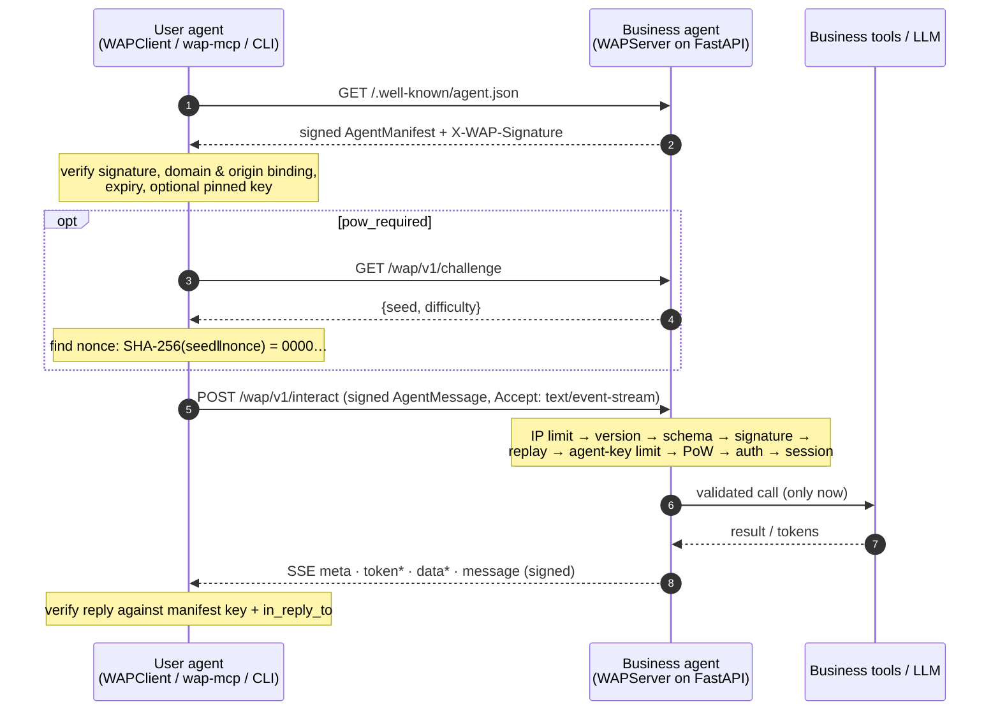

# WebAgent Protocol (WAP)

**AI agents discover, negotiate, and transact directly with businesses' AI agents, without scraping.**

WAP is an open standard and a Python reference implementation. A website publishes a signed manifest at
`/.well-known/agent.json` that describes what its agent can do. Any AI agent can then call those capabilities
with schema-validated JSON, stream the reply, and verify through Ed25519 signatures that the answer really came
from that domain. The business's back-end (inventory systems, paid LLMs) is protected by proof-of-work and
rate limits that are built into the protocol.

```text
pip install -e ".[server,mcp]"        # from a clone of this repository
python examples/bakery_server.py      # a business agent on :8000
wap ask localhost:8000 "Do you have sourdough croissants?"
```

| | |
|---|---|
| 📜 **Spec** | [`docs/spec_rfc.md`](docs/spec_rfc.md): WAP/1.0 in Internet-Draft style (headers, errors, state machines) |
| 📄 **Whitepaper** | [`docs/whitepaper.md`](docs/whitepaper.md): *Beyond Scraping: Protocol-Mediated Agentic Web* |
| 🏪 **Provider SDK** | `wap.server`: FastAPI drop-in with `@wap.action`, SSE, PoW, and rate limiting |
| 🛒 **Consumer SDK** | `wap.client`: async resolver, verifier, PoW solver, and SSE streamer |
| 🔌 **MCP bridge** | `wap-mcp`: lets Claude, Cursor, and Codex talk to any WAP site |
| ⌨️ **CLI** | `wap ask / inspect / verify / keygen / serve` |

---

## Why

Today, agents read websites the way humans do. They render HTML, guess which number is the price, and
simulate clicks. This approach is expensive, breaks on every redesign, and cannot prove where the data came
from. When a business puts an LLM behind a chat widget, every scripted question also costs the business money.

WAP replaces this with an explicit contract:

| | Scraping | WAP |
|---|---|---|
| Context per query (benchmark storefront) | ≈ 7,071 tokens of HTML | **≈ 299 tokens** (schema + result) |
| Data | inferred from markup | typed JSON validated by JSON Schema |
| Actions (hold, negotiate, order) | simulated clicks | first-class capabilities |
| Authenticity | none | Ed25519 signature on every reply |
| Abuse protection | CAPTCHAs aimed at humans | proof-of-work + per-IP/per-key limits aimed at agents |

These numbers come from `python examples/benchmark.py`. The whitepaper describes the method and its caveats,
including the fact that against *well-stripped visible text*, WAP's token saving is modest. The main gains
are correctness, the ability to act, and authenticity.

## Architecture



```text
wap/
├── spec/      models.py (Pydantic v2 wire contracts) · crypto.py (Ed25519, canonical JSON) · pow.py (Hashcash engine)
├── server/    app.py (WAPServer, @action, dispatch) · router.py (endpoints, SSE) · middleware.py · rate_limiter.py
├── client/    resolver.py (discovery, verification, cache) · session.py (WAPClient, WAPSession) · exceptions.py
├── mcp/       bridge.py (MCP server: wap_discover, wap_interact, wap_ask)
└── cli/       main.py (typer + rich)
```

## Quickstart

### 1. Install

```bash
git clone https://github.com/varadganjoo/WebAgent-Protocol && cd WebAgent-Protocol
python -m venv .venv && source .venv/bin/activate
pip install -e ".[dev]"          # core + server + mcp + test tools
```

The distribution is named `wap` with extras: `wap` (client + CLI), `wap[server]` (FastAPI provider), and
`wap[mcp]` (MCP bridge). Python 3.11+ is required.

### 2. Expose a business agent

```python
import os

from fastapi import FastAPI
from pydantic import BaseModel
from wap.server import WAPServer, ActionContext

wap = WAPServer(
    name="Golden Crust Bakery",
    domain="bakery.example",
    private_key=os.environ["WAP_PRIVATE_KEY"],   # from `wap keygen`
    require_pow=True,                             # Hashcash gate before any tool runs
)

class StockLevel(BaseModel):
    item: str
    available: int
    unit_price: float

@wap.action(name="check_pastry_stock", description="Units available right now.")
async def check_pastry_stock(item: str) -> StockLevel:        # → input & output JSON Schema
    row = await db.fetch_stock(item)
    return StockLevel(item=row.name, available=row.qty, unit_price=row.price)

@wap.action(name="reserve_item", description="Hold pastries for 30 minutes.")
async def reserve_item(item: str, quantity: int = 1, ctx: ActionContext = None) -> dict:
    ...                                          # ctx: session state, principal, client IP

@wap.intent                                      # optional: free-text requests → your LLM / router
async def front_desk(intent: str, ctx: ActionContext):
    async for token in my_llm.stream(intent, tools=ctx.server.actions):
        yield token                              # streamed to the client as SSE `token` events

app = FastAPI()
wap.mount(app)   # adds /.well-known/agent.json, /wap/v1/interact, /wap/v1/challenge
```

Actions can be `async` or sync functions, generators, or async generators. They can return a `str`, a `dict`,
a Pydantic model, or `ActionResult(content=..., data=...)`. Parameters of type `ActionContext` are injected
and never exposed in the schema. For non-FastAPI ASGI apps, wrap them with
`WAPDiscoveryMiddleware(app, wap)` to publish the manifest.

### 3. Talk to it from Python

```python
from wap import WAPClient

async with WAPClient() as client:
    manifest = await client.discover("bakery.example")          # verified & cached

    # stream a free-text request
    async for event in client.query("bakery.example", "Any sourdough croissants left?"):
        if event.type == "token":
            print(event.text, end="")

    # call a capability: payload validated against input_schema before sending, PoW solved automatically
    stock = await client.invoke("bakery.example", "check_pastry_stock", {"item": "Sourdough Croissant"})
    print(stock.structured_data, stock.verified)

    # multi-turn negotiation with server-side session state
    session = client.session("bakery.example")
    offer = await session.send(capability_id="negotiate_bulk_price",
                               payload={"item": "Sourdough Croissant", "quantity": 12, "offered_unit_price": 3.6})
```

Errors are typed: `ManifestNotFound`, `VerificationFailed`, `CapabilityNotFound`, `SchemaValidationError`,
`RateLimited` (with `.retry_after`), `AuthRequired`, `ProofOfWorkFailed`, and `ProtocolError`.

### 4. Use the CLI

```bash
wap keygen --out bakery.key                       # Ed25519 key pair (file mode 0600)
wap inspect localhost:8000                        # manifest + capability schemas
wap verify  bakery.example --expect-key <hex>     # every authenticity check, itemised
wap ask localhost:8000 "hold 2 almond croissants for Ada"
wap ask localhost:8000 -c check_pastry_stock -d '{"item": "Baguette"}' --json
wap serve examples.bakery_server:app --port 8000
```

### 5. Connect Claude, Cursor, or Codex (MCP)

The `wap-mcp` command runs an MCP server over stdio with three tools:

* `wap_discover(domain)`: returns the verified manifest and capability schemas.
* `wap_interact(domain, capability, parameters, session_id?)`: executes a capability and returns verified JSON.
* `wap_ask(domain, query, session_id?)`: sends a free-text request.

**Claude Desktop** (`claude_desktop_config.json`), **Cursor** (`.cursor/mcp.json`):

```json
{
  "mcpServers": {
    "webagent": {
      "command": "wap-mcp",
      "env": { "WAP_BLOCK_PRIVATE_NETWORKS": "1" }
    }
  }
}
```

**Claude Code:** `claude mcp add webagent -- wap-mcp`

**Codex** (`~/.codex/config.toml`):

```toml
[mcp_servers.webagent]
command = "wap-mcp"
env = { WAP_BLOCK_PRIVATE_NETWORKS = "1" }
```

The bridge reads the following environment variables:

| Variable | Purpose |
|---|---|
| `WAP_AGENT_KEY` | Hex Ed25519 private key for signing requests. If unset, an ephemeral key is used. |
| `WAP_BLOCK_PRIVATE_NETWORKS` | Set to `1` to refuse domains that resolve to private or loopback IPs. This is the SSRF guard, recommended when a model picks the domains. Leave it off to reach `localhost` demos. |
| `WAP_ALLOW_INSECURE` | Allows plain HTTP to non-loopback hosts. |
| `WAP_PINNED_KEYS` | JSON object `{"domain": "<hex key>"}`. |
| `WAP_AUTH_TOKENS` | JSON object `{"domain": "<bearer token>"}`, used for `requires_auth` capabilities. |

## The demo: a shopper negotiating with a bakery

```bash
python examples/bakery_server.py        # terminal 1
python examples/shopper_agent.py        # terminal 2
```

```text
───────────────────────────── Golden Crust Bakery ──────────────────────────────
verified manifest for localhost:8000 · key SHA256:0255a81d69f4b1da18e787b70b9fe6f2
proof-of-work: difficulty 4 · capabilities: get_menu, check_pastry_stock, negotiate_bulk_price, reserve_item

› Do you have Sourdough Croissants today?
Yes! 24 x Sourdough Croissant available at $4.50 each.

check_pastry_stock → 24 available at $4.50 (PoW solved: True, 0.01s)
     Negotiating 12 x Sourdough Croissant
┏━━━━━━━┳━━━━━━━━━━┳━━━━━━━━━━━━━━━┳━━━━━━━━━┓
┃ round ┃ we offer ┃ bakery says   ┃ counter ┃
┡━━━━━━━╇━━━━━━━━━━╇━━━━━━━━━━━━━━━╇━━━━━━━━━┩
│ 1     │ $3.60    │ counter_offer │ $4.05   │
│ 2     │ $3.83    │ final_offer   │ $4.05   │
│ 3     │ $4.05    │ accepted      │ —       │
└───────┴──────────┴───────────────┴─────────┘

✔ reservation confirmed 12 x Sourdough Croissant @ $4.05 = $48.60
reservation token: RSV-49A842BF02D8B18E
```

## Security model at a glance

* **Domain authenticity.** The manifest is signed with the domain's Ed25519 key and bound to the exact
  authority it was fetched from. Interaction URLs must stay on that origin, and discovery never follows
  redirects. Keys can be pinned.
* **Reply integrity.** Every reply, including every SSE final message, is signed and verified against the
  *manifest* key, then bound to the request with `in_reply_to`. Streamed tokens are provisional until the
  signed message arrives. A man-in-the-middle test in the suite confirms that tampered replies are rejected.
* **Request integrity.** Requests are signed by a per-client agent key. Each carries a ±300 s timestamp
  window and a `message_id` replay cache. Sessions are bound to the key that opened them.
* **Economic defence.** Challenges are stateless and HMAC-authenticated. The difficulty is bound into the
  seed and each seed can be used once. Requests are also limited per IP and per verified agent key, using a
  sliding window combined with a token bucket. The pipeline runs the cheapest checks first, so no business
  code runs for rejected traffic.
* **Untrusted content.** Signed means *attributable*, not *safe*. Treat reply text as data.

Details: [spec §13](docs/spec_rfc.md#13-security-considerations).

## Development

```bash
pytest -q                          # 176 tests: spec, crypto, PoW, rate limits, server, client, e2e, MCP, CLI
ruff check wap examples tests && ruff format --check wap examples tests
python examples/benchmark.py       # regenerate whitepaper numbers
```

The test suite runs entirely in-process through `httpx.ASGITransport`, with no network or ports. It covers
hostile manifests (forged, re-keyed, expired, off-origin, redirected, oversized), replay, session hijacking,
PoW downgrade and reuse, concurrent over-booking, and reply tampering in both JSON and SSE modes.

## License

MIT. See [LICENSE](LICENSE).
